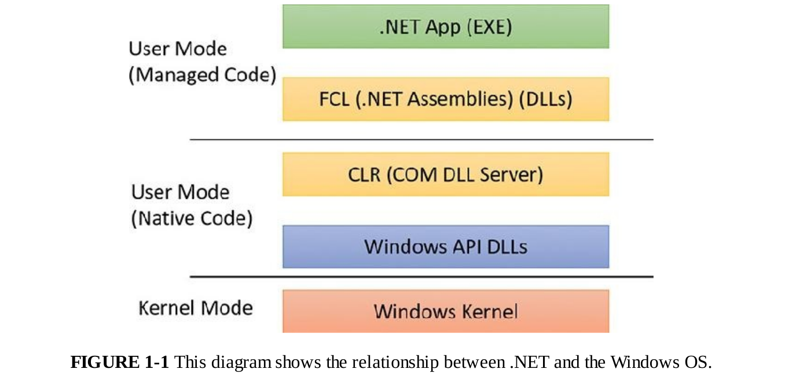

# Windows API
The Windows application programming interface (API) is the user-mode system programming interface to
the Windows OS family. Prior to the introduction of 64-bit versions of Windows, the programming
interface to the 32-bit versions of the Windows OS was called the Win32 API to distinguish it from the
original 16-bit Windows API, which was the programming interface to the original 16-bit versions of
Windows. In this book, the term Windows API refers to both the 32-bit and 64-bit programming interfaces
to Windows.
# -----------------------------------------------------------------
# COM
 com  was originally created to enable Microsoft Office applications to communicate and exchange
data between documents (such as embedding an Excel chart inside a Word document or a PowerPoint
presentation). This ability is called Object Linking and Embedding (OLE).



## Services, functions, and routines

# Windows API functions
 These are documented, callable subroutines in the Windows API.
Examples include CreateProcess, CreateFile, and GetMessage.
# Native system services (or system calls)
 These are the undocumented, underlying services in the
OS that are callable from user mode. For example, NtCreateUserProcess is the internal
system service the Windows CreateProcess function calls to create a new process.

# Kernel support functions (or routines)
 These are the subroutines inside the Windows OS that can
be called only from kernel mode (defined later in this chapter). For example,
ExAllocatePoolWithTag is the routine that device drivers call to allocate memory from the
Windows system heaps (called pools).

# Windows services 
These are processes started by the Windows service control manager. For
example, the Task Scheduler service runs in a user-mode process that supports the schtasks
command (which is similar to the UNIX commands at and cron). (Note that although the registry
defines Windows device drivers as “services,” they are not referred to as such in this book.)

# Dynamic link libraries (DLLs)
 These are callable subroutines linked together as a binary file that
can be dynamically loaded by applications that use the subroutines. Examples include Msvcrt.dll
(the C run-time library) and Kernel32.dll (one of the Windows API subsystem libraries). Windows
user-mode components and applications use DLLs extensively. The advantage DLLs provide over
static libraries is that applications can share DLLs, and Windows ensures that there is only one in-
memory copy of a DLL’s code among the applications that are referencing it. Note that library .NET
assemblies are compiled as DLLs but without any unmanaged exported subroutines. Instead, the
CLR parses compiled metadata to access the corresponding types and members.

I came across one of the standard tools called "```Dependency Walker```" which helps understand EXE and DLL files and their dependencies. In the image below, I've opened the familiar Kernel32.dll file which lets the application interact with Win32 APIs. Also, we can see it lists all the sub-dependencies of DLL files along with the import and export functions on the right. This tool gives a general idea of what Win32 APIs function an exe or DLL is calling. I just started using this to get an idea of how an application is interacting with the Windows Kernel in a high-level overview. Although, there are many advanced tools. This tool is just for beginners who want to understand in an easier way.
